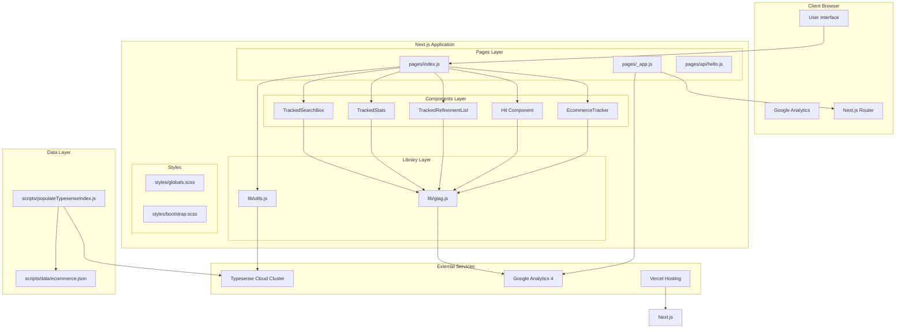
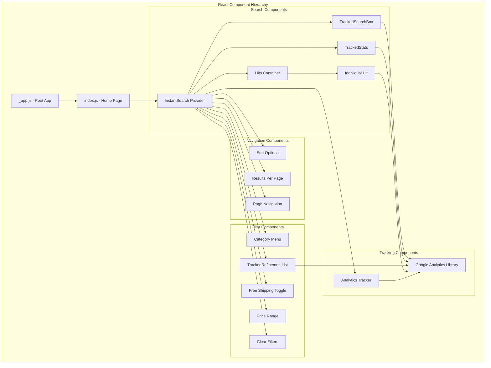
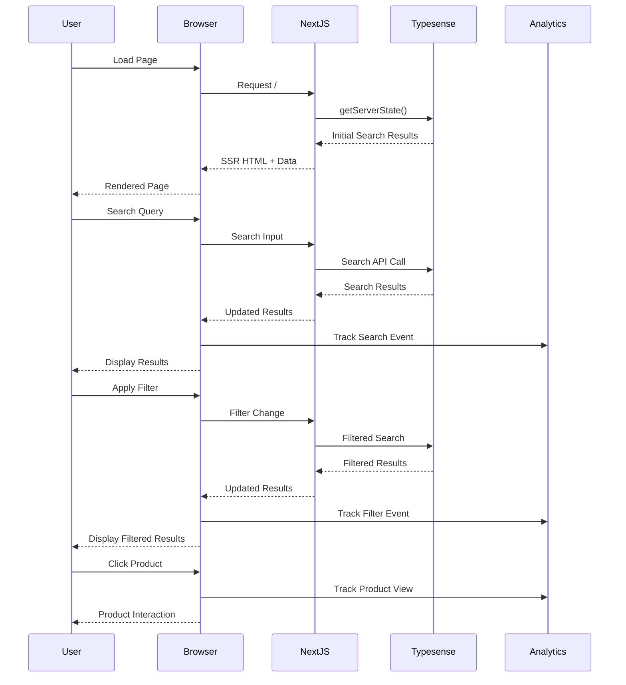
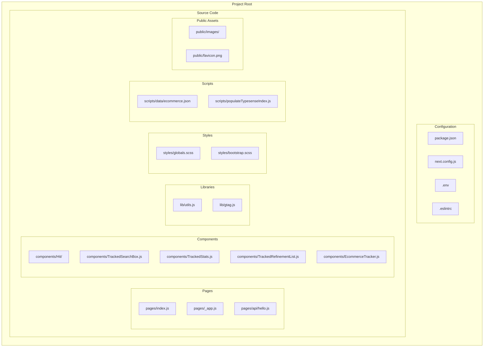
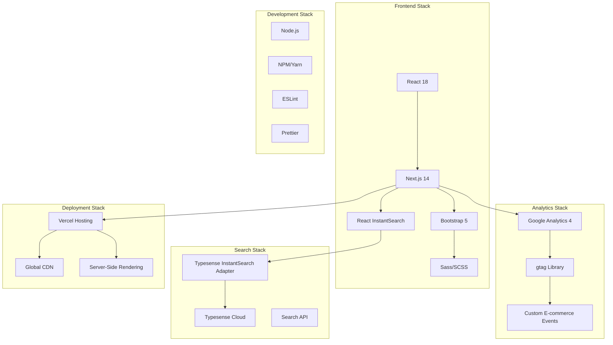
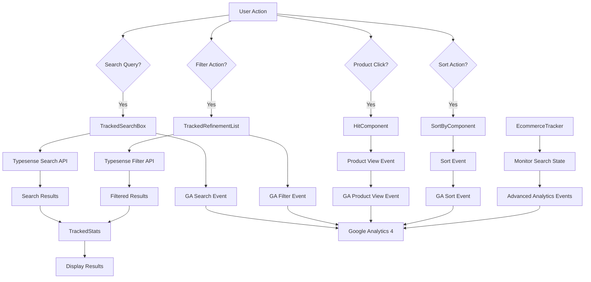
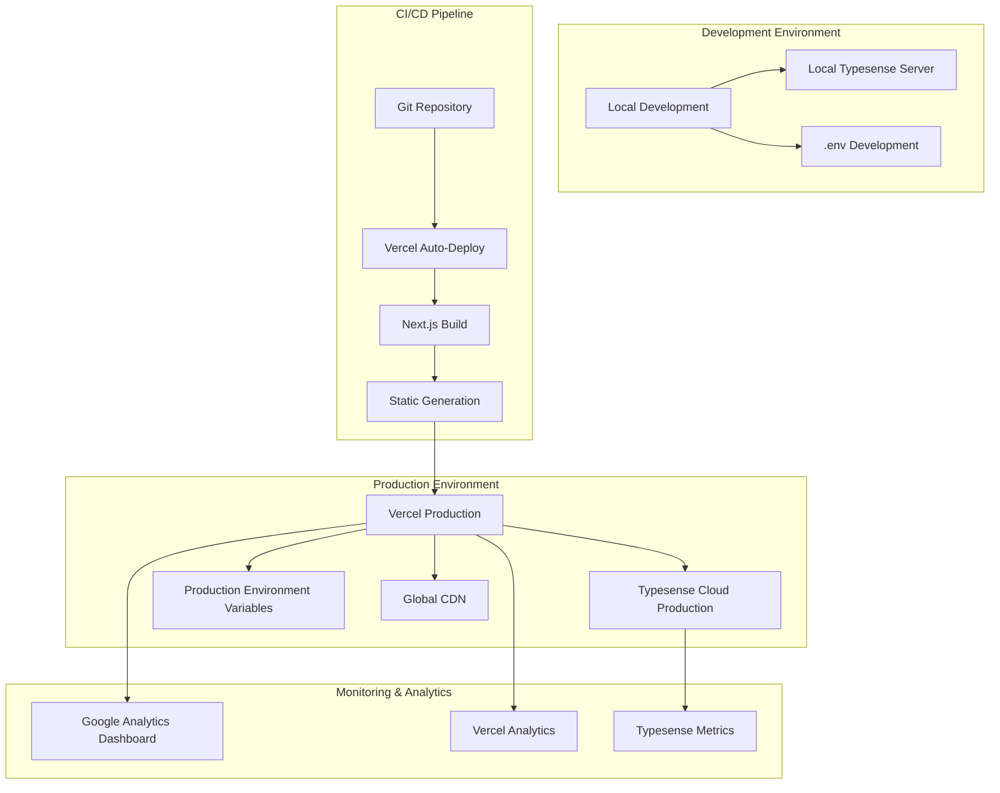

# Project Architecture

## System Architecture Overview

## Component Architecture

## Data Flow Architecture

## File Structure Architecture

## Technology Stack Architecture

## Search & Analytics Flow

## Deployment Architecture

